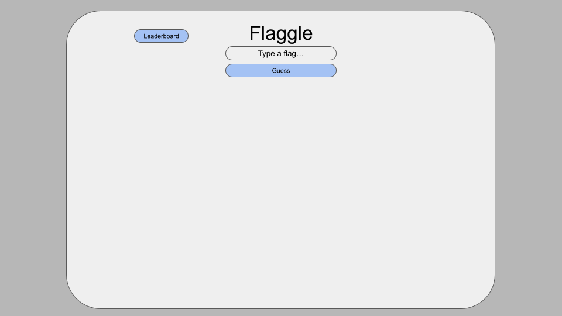
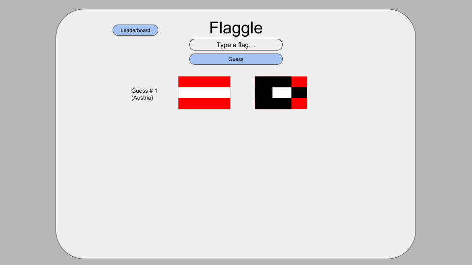
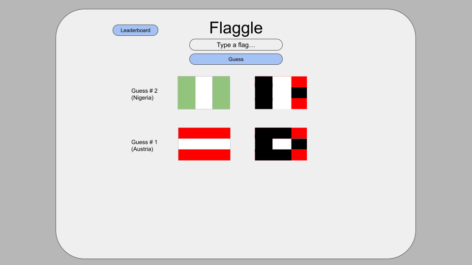
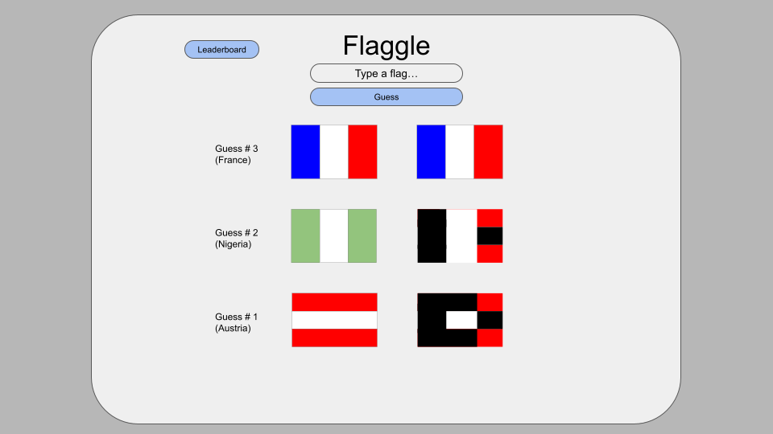
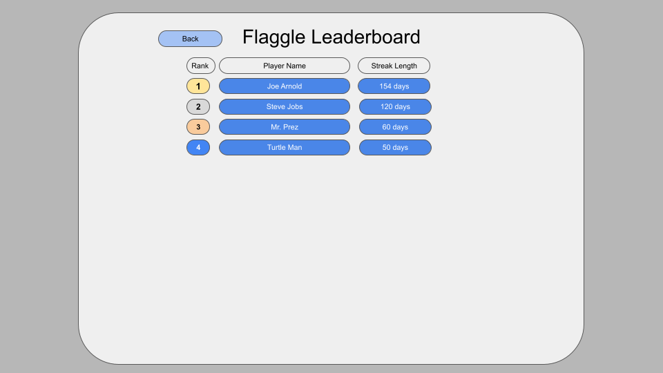
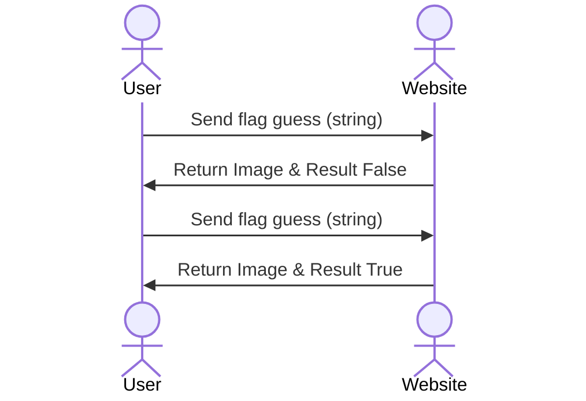

# Flaggle Game

This game is just like wordle, but with flags. You guess a flag and see how close you are. The game will display the colors of the flag that you got correct. You keep guessing until you get the daily flag.

### Elevator pitch

Do you love flags? Do you love wordle and other fun newyorktimes games? This website combines your love of flags with a simple game. Your goal is to guess the daily flag in as few guesses as possible. After each guess the matching parts of your flag and the daily flag are revealed to you, giving you more information. Keep guessing until you get the daily flag!

### Design

When the user gets to the website they will see this login page. This will be the first page they see. They can click create account for first time visit.

After creating an account the website will direct you to the main page.

After the user logs in to their account they will be brought to this page. The user can enter in a flag type to the text box. Then they will click the guess button which will submit their guess.

The website will display all locations where the color matches between the guess and the flag of the day. For example the red and white are displayed, while the rest is blacked out.

After a second guess the user still retains the red revealed from the previous guess. The user also reveals the white column in the flag with their guess.

The flag on the right will match the flag on the left when the user gets their guess correct

The user can navigate to the leaderboard from the main page through a button labeled leaderboard. The back button navigates back to the main page.

### Key features

- Secure login over HTTPS
- Daily streak
- Player statistics are recorded
- Competitive online leaderboards
- Interactive game design

### Technologies

I am going to use the required technologies in the following ways.

- **HTML** - HTML will be used to route players between pages. There will be a login page, create account page, game page and leaderboard page. 
- **CSS** - CSS is essential in the styling of the page and also visual adaptation for mobile. This website should look presentable on mobile as that is going to be the most common platform.
- **React** - React will update the user's end to display the updated flag. It will also create the session and allow the user to rejoin that session.
- **Service** - Services that I will use are logging in, creating an account, update profile statistics, update leaderboard. I will also use an API call to get a map of the country that matches the flag of the day with this link: https://github.com/lennertVanSever/graphcountries
- **DB/Login** - DB will store the user's login information and statistics. It will be used to authenticate their login as well.
- **WebSocket** - Times and guess count will notify to all players to update the leaderboard. It will also notify the user of each individual that completes the flaggle while they are on the main page or leaderboard page.

## 🚀 Specification Deliverable

- [x] Proper use of Markdown
- [x] A concise and compelling elevator pitch
- [x] Description of key features
- [x] Description of how you will use each technology
- [x] One or more rough sketches of your application. Images must be embedded in this file using Markdown image references.

## 🚀 AWS deliverable

- [x] **Server deployed and accessible with custom domain name** - [My server link](https://flagle.click/).

## 🚀 HTML deliverable

# Notes
- 

- [x] **HTML pages** - I have Four HTML pages, the main being named index.html.
- [ ] **Proper HTML element usage** - I did not complete this part of the deliverable.
- [ ] **Links** - I did not complete this part of the deliverable.
- [ ] **Text** - I did not complete this part of the deliverable.
- [ ] **3rd party API placeholder** - I did not complete this part of the deliverable.
- [ ] **Images** - I did not complete this part of the deliverable.
- [ ] **Login placeholder** - I did not complete this part of the deliverable.
- [ ] **DB data placeholder** - I did not complete this part of the deliverable.
- [ ] **WebSocket placeholder** - I did not complete this part of the deliverable.

## 🚀 CSS deliverable

- [ ] **Visually appealing colors and layout. No overflowing elements.** - I did not complete this part of the deliverable.
- [ ] **Use of a CSS framework** - I did not complete this part of the deliverable.
- [ ] **All visual elements styled using CSS** - I did not complete this part of the deliverable.
- [ ] **Responsive to window resizing using flexbox and/or grid display** - I did not complete this part of the deliverable.
- [ ] **Use of a imported font** - I did not complete this part of the deliverable.
- [ ] **Use of different types of selectors including element, class, ID, and pseudo selectors** - I did not complete this part of the deliverable.

## 🚀 React part 1: Routing deliverable

- [ ] **Bundled using Vite** - I did not complete this part of the deliverable.
- [ ] **Components** - I did not complete this part of the deliverable.
- [ ] **Router** - I did not complete this part of the deliverable.

## 🚀 React part 2: Reactivity deliverable

- [ ] **All functionality implemented or mocked out** - I did not complete this part of the deliverable.
- [ ] **Hooks** - I did not complete this part of the deliverable.

## 🚀 Service deliverable

- [ ] **Node.js/Express HTTP service** - I did not complete this part of the deliverable.
- [ ] **Static middleware for frontend** - I did not complete this part of the deliverable.
- [ ] **Calls to third party endpoints** - I did not complete this part of the deliverable.
- [ ] **Backend service endpoints** - I did not complete this part of the deliverable.
- [ ] **Frontend calls service endpoints** - I did not complete this part of the deliverable.
- [ ] **Supports registration, login, logout, and restricted endpoint** - I did not complete this part of the deliverable.

## 🚀 DB deliverable

- [ ] **Stores data in MongoDB** - I did not complete this part of the deliverable.
- [ ] **Stores credentials in MongoDB** - I did not complete this part of the deliverable.

## 🚀 WebSocket deliverable

- [ ] **Backend listens for WebSocket connection** - I did not complete this part of the deliverable.
- [ ] **Frontend makes WebSocket connection** - I did not complete this part of the deliverable.
- [ ] **Data sent over WebSocket connection** - I did not complete this part of the deliverable.
- [ ] **WebSocket data displayed** - I did not complete this part of the deliverable.
- [ ] **Application is fully functional** - I did not complete this part of the deliverable.
