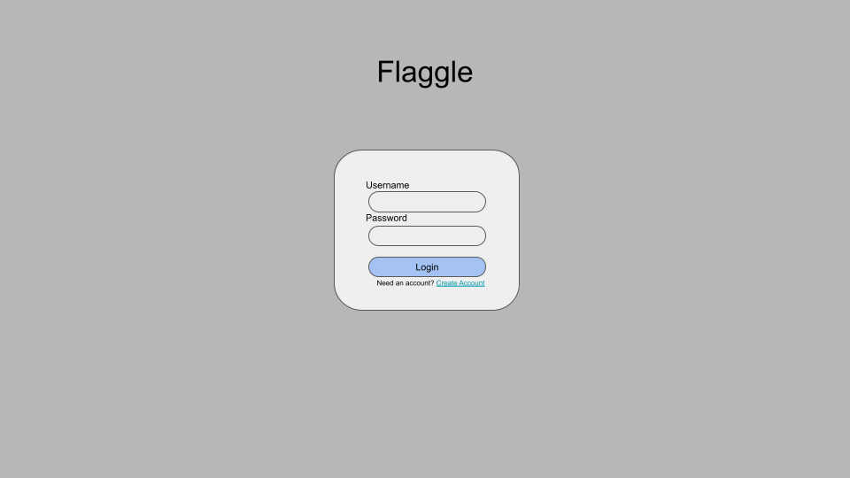
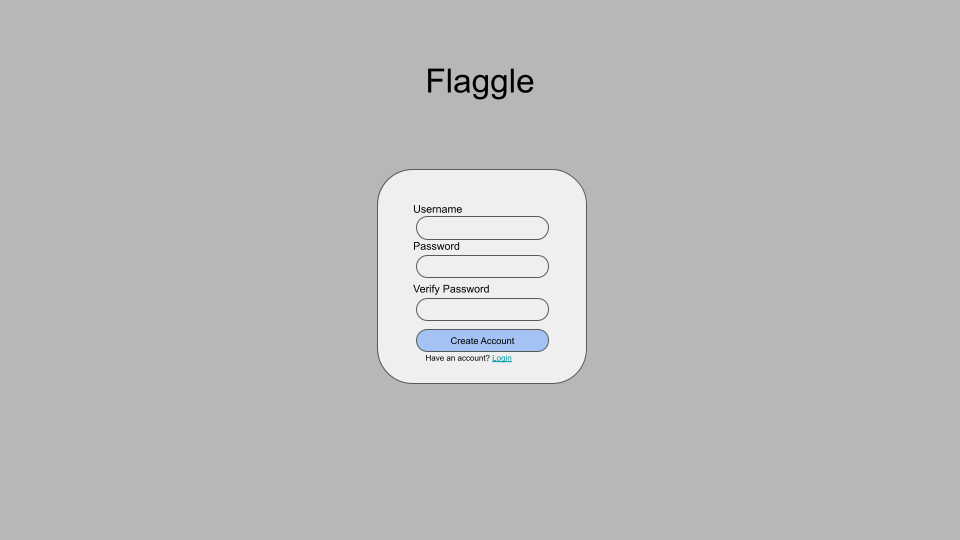
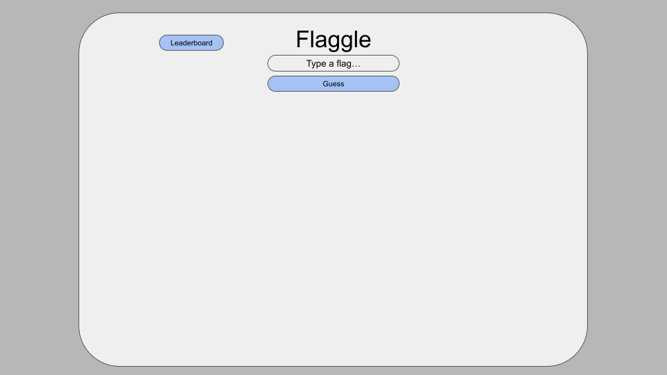
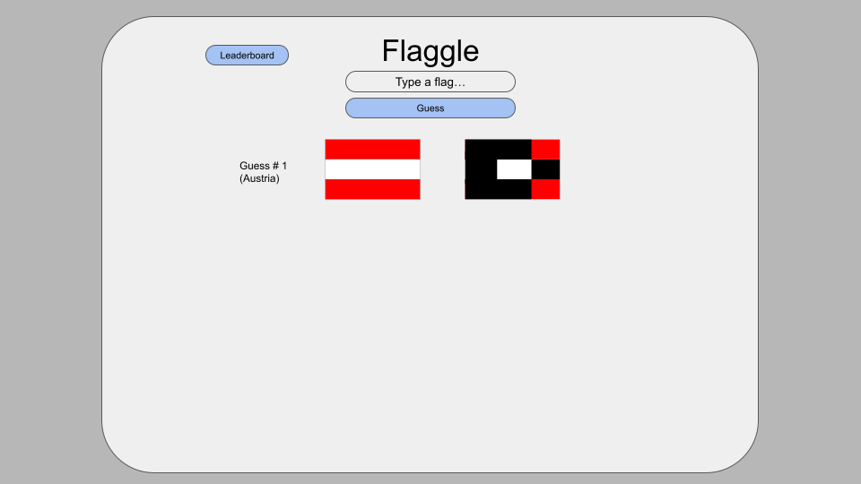
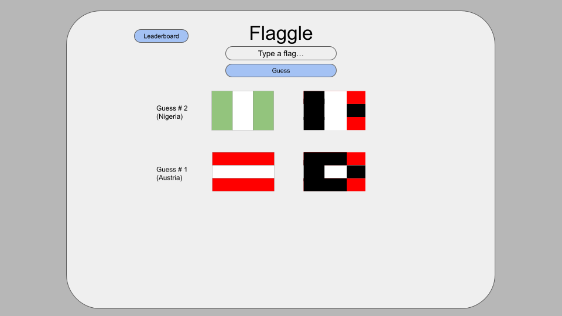
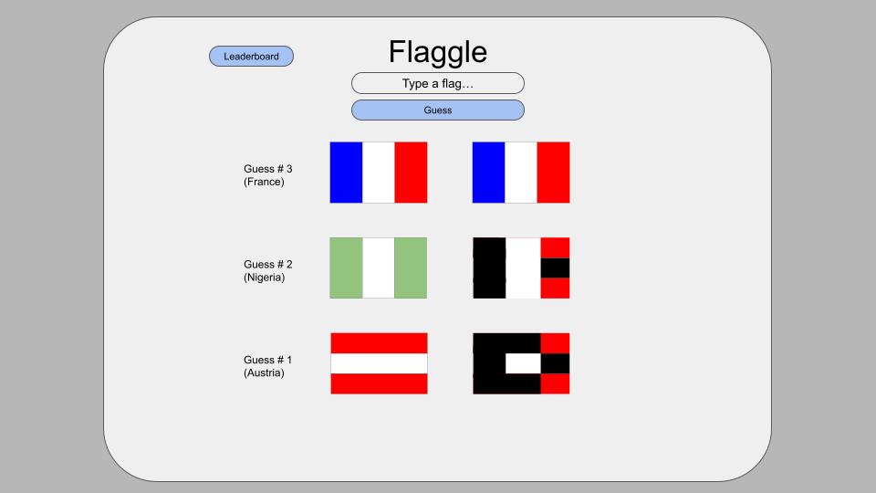
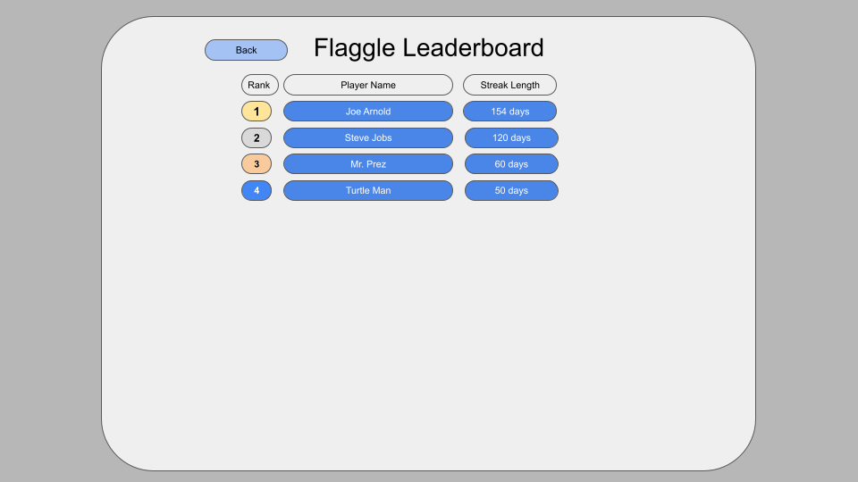
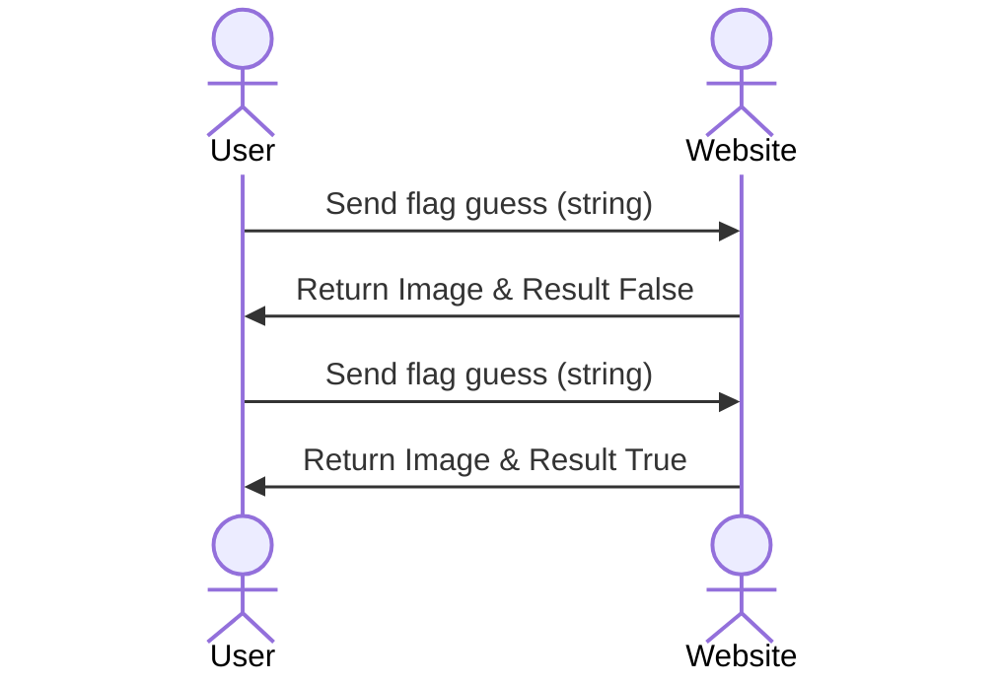

# Flaggle Game

This game is just like wordle, but with flags. You guess a flag and see how close you are. The game will display the colors of the flag that you got correct. You keep guessing until you get the daily flag.

### Elevator pitch

Do you love flags? Do you love wordle and other fun newyorktimes games? This website combines your love of flags with a simple game. Your goal is to guess the daily flag in as few guesses as possible. After each guess the matching parts of your flag and the daily flag are revealed to you, giving you more information. Keep guessing until you get the daily flag!

### Design

When the user gets to the website they will see this login page. This will be the first page they see. They can click create account for first time visit.

After creating an account the website will direct you to the main page.

After the user logs in to their account they will be brought to this page. The user can enter in a flag type to the text box. Then they will click the guess button which will submit their guess.

The website will display all locations where the color matches between the guess and the flag of the day. For example the red and white are displayed, while the rest is blacked out.

After a second guess the user still retains the red revealed from the previous guess. The user also reveals the white column in the flag with their guess.

The flag on the right will match the flag on the left when the user gets their guess correct

The user can navigate to the leaderboard from the main page through a button labeled leaderboard. The back button navigates back to the main page.

```mermaid
sequenceDiagram
    actor User
    actor Website
    User->>Website: Send flag guess (string)
    Website->>User: Return Image & Result False
    User->>Website: Send flag guess (string)
    Website->>User: Return Image & Result True
```

### Key features

- Secure login over HTTPS
- Daily streak
- Player statistics are recorded
- Competitive online leaderboards
- Interactive game design

### Technologies

I am going to use the required technologies in the following ways.

- **HTML** - HTML will be used to route players between pages. There will be a login page, create account page, game page and leaderboard page.
- **CSS** - CSS is essential in the styling of the page and also visual adaptation for mobile. This website should look presentable on mobile as that is going to be the most common platform.
- **React** - React will update the user's end to display the updated flag. It will also create the session and allow the user to rejoin that session.
- **Service** - Services that I will use are logging in, creating an account, update profile statistics, update leaderboard. I will also use an API call to get a map of the country that matches the flag of the day with this link: https://github.com/lennertVanSever/graphcountries
- **DB/Login** - DB will store the user's login information and statistics. It will be used to authenticate their login as well.
- **WebSocket** - Times and guess count will notify to all players to update the leaderboard. It will also notify the user of each individual that completes the flaggle while they are on the main page or leaderboard page.

## 🚀 Specification Deliverable

- [x] Proper use of Markdown.
- [x] A concise and compelling elevator pitch.
- [x] Description of key features.
- [x] Description of how you will use each technology.
- [x] One or more rough sketches of your application. Images must be embedded in this file using Markdown image references.

## 🚀 AWS deliverable

- [x] **Server deployed and accessible with custom domain name** - [My server link](https://flagle.click/).

## 🚀 HTML deliverable

# Notes

- I will want to remember how my API request works for flagsAPI
- Here is an example: https://flagsapi.com/AU/flat/32.png This gets the Australian flag
- Structure my Leaderboard as a table when styling it in CSS
- Daily and Unlimited Flagle will be duplicates but should add to different numbers in the DB

- [x] **HTML pages** - I have Five HTML pages.
- [x] **Proper HTML element usage** - I used BODY, TABLE, NAV, MAIN, HEADER and FOOTER. I kept my FOOTER simple with a link to my github on each page. The HEADER is the same on each page with links to all necessary pages. I used BODY for all content between the HEADER and FOOTER. I used NAV with a MENU in the same style as the Simon demo inside the HEADER. I was able to use TABLE for both the leaderboard and the placeholder for my flags in daily.html and unlimited.html
- [x] **Links** - Links are found at the top of the page to navigate between Leaderboard, Home, Daily and Unlimited
- [x] **Text** - Flag guesses are displayed as text on the daily.html and unlimited.html screen
- [x] **3rd party API placeholder** - I was able to do a 3rd party API call to flagsapi.com on my leaderboard page for each player's country flag
- [x] **Images** - I added a flag banner image seen at the top of every page. I also use svg for my drawing of my flags on the daily.html and unlimited.html screen
- [x] **Login placeholder** - I have a login placeholder on the login.html page and a create account placeholder on the create_account.html
- [x] **DB data placeholder** - The DB data placeholder is the leaderboard information, player rank, country, name, daily streak and starting date are all stored in the database
- [x] **WebSocket placeholder** - The community total will update from WebSocket game completions. In addition to that my daily.html and unlimited.html screens will show players starting and completing games from WebSockets

## 🚀 CSS deliverable

Notes

- I need to remember the styling colors that I've used:
  Footer/menu bar: background-color: #212121
  Menu hover/curr_page: background-color: #111111

- This is my codepen link from practice: https://codepen.io/Searlejk/pen/wBWXqBB

- This is my link to the other codepen practice: https://codepen.io/Searlejk/pen/pvbKawO?editors=0100

Prerequisites:
[x] - I added the simon CSS to my website

- [x] **Visually appealing colors and layout. No overflowing elements.** - I use calm darker colors. Everything is contained to the screen. The layout is simple and easy to navigate.
- [x] **Use of a CSS framework** - I used the CSS framework for basic bootstrap to make fonts and other details more standardized. This helped with buttons and input boxes.
- [x] **All visual elements styled using CSS** - I styled every part of this website either in CSS or by using a boostrap style.
- [x] **Responsive to window resizing using flexbox and/or grid display** - By adding flex to my css I was able to make sure it adapted to window resizing.
- [x] **Use of a imported font** - I added a semi-bold Montserrat font from google. I applied it to everything.
- [x] **Use of different types of selectors including element, class, ID, and pseudo selectors** - I used each of these in my css code. My pseduo selector was hover, my ID was #notificationCollapse in daily.css. I used a ton of elements and classes.

## 🚀 React part 1: Routing deliverable

Notes

- reading the info regarding the react part 1
- I am going to store my simon react in a burner folder, so that it is not part of this repository
- I just deployed the react for simon to my simon.flagle.click website
- [x] - Sort files.
- [x] - refactor files.
- [x] - install bootstrap.
- [x] - Fix login button.
- [x] - Fix create account button.
- [x] - Fix flag banner image styling later (its in the header now).
- [x] - Fix footer so it appear correctly.

- [x] **Bundled using Vite** - I sorted all of my files and used vite so I can preview the files. It also allowed me to tweak my code while previewing the website.
- [x] **Components** - I have multiple react components. One for each view/page and they use HTML structure and CSS styling.
- [x] **Router** - I used BrowserRouter and Routes to navigate, I also used NavLink which helped. This way I am able to go from page to page.

## 🚀 React part 2: Reactivity deliverable

Notes

- [x] Remove all HTML files that are still in my project.
- [x] Only add vertical flag types.
- [x] Add notification for player starting game.
- [x] Add notification for player finishing game.
- [x] Make the Notification number update correctly.
- [x] Add score/leaderboard update after each game.
- [x] Make gamesPlayed reset to 0 after logout.
- [x] After user wins, don't let them submit another flag.
- [x] Make daily visually persist when swapping tabs.
- [x] Make allowPlayer persist for Daily.
- [x] Implement Unlimited Functionality.
- [x] Add new game button to Unlimited.
- [x] Update Community game count to be accurate.
- [x] Update the notifications item in Unlimited for spacing but make it disapear.
- [x] Space out buttons on the main view after logging in.
- [x] Make Leaderboard sort most games played first.
- [x] Add quite a few more flag options.
- [x] Stop Unlimited from being France first.

- [x] **All functionality implemented or mocked out** - In my bullet points above you can see a few things. All buttons have been changed to react. I changed over the leaderboard, which updates. I changed over the notifications which update as well as you start or finish a match. The text box as well uses some react.
- [x] **Hooks** - I used hooks to store and modify data in the game. Specifically I used it most in the flagleGame file. I used it for rows, allowPlayer (like simon), win/setWin, and the user's input.

## 🚀 Service deliverable

# Notes

- [x] Finish video on how it works.
- [x] Add Username compatibility/storage.
- [x] Add password compatibility/storage.
- [x] Add password encryption.
- [x] Add login stuff (the rest).
- [x] Add scores/leaderboard stuff.
- [x] Make game save scores.
- [x] Use API calls to get flags for leaderboard.
- [x] Have user input country when creating an account, but not when logging in.
- [x] Make it impossible to select tab unless logged in, or created account. Once logged out do that same thing.
- [x] add drop down for country code.
- [x] have my code verify the country code works.
- [x] Make create button only work if country code works.
- [x] Make my flag only draw if the country code is in the countryCodes list, otherwise do nothing.
- [ ] Add simple loading animation to leaderboard.

# Requirements

- [x] **Node.js/Express HTTP service** - I specifically store country name and then build a url out of it to use for my API call later.
- [x] **Static middleware for frontend** - I verify my auth token with middleware.
- [x] **Calls to third party endpoints** - I use my third party call for the flags in the leaderboard section. This allows for flags to be drawn for each user who is on the leaderboard dynamically based on their profile's country of choice. I used flagcdn specifically.
- [x] **Backend service endpoints** - I used all of the simple ones from simon, but I adapted many of them. The most different is score, this is because my score data needed to be stored with more information and be calculated out after each post.
- [x] **Frontend calls service endpoints** - I did this, specifically my create account needed to include the user's country. I added a drop down menu and also a flag that is generated based on the users input.
- [x] **Supports registration, login, logout, and restricted endpoint** - Relying heavily on Simon logic, I got registration, login, logout and restricted endpoints to work.

## 🚀 DB deliverable

- [ ] **Stores data in MongoDB** - I did not complete this part of the deliverable.
- [ ] **Stores credentials in MongoDB** - I did not complete this part of the deliverable.

## 🚀 WebSocket deliverable

- [ ] **Backend listens for WebSocket connection** - I did not complete this part of the deliverable.
- [ ] **Frontend makes WebSocket connection** - I did not complete this part of the deliverable.
- [ ] **Data sent over WebSocket connection** - I did not complete this part of the deliverable.
- [ ] **WebSocket data displayed** - I did not complete this part of the deliverable.
- [ ] **Application is fully functional** - I did not complete this part of the deliverable.
